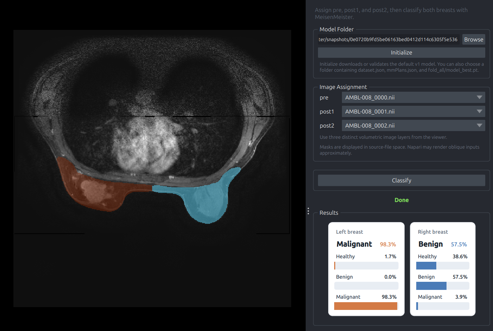

# napari-meisenmeister



`napari-meisenmeister` brings the MeisenMeister bilateral breast MRI classifier into napari.

The widget is built for the MeisenMeister `v1` portable model layout and expects three volumetric inputs per case:

- `pre`
- `post1`
- `post2`

When you click `Classify`, the plugin writes a temporary single-case MeisenMeister input folder, runs portable inference with `fold_all`, creates breast / left / right segmentations under the hood, and renders per-side probability cards for `healthy`, `benign`, and `malignant`.

## Installation

Create and activate a conda environment first:

```bash
conda create -n napari-meisenmeister python=3.12 -y
conda activate napari-meisenmeister
```

Then install everything with:

```bash
git clone https://github.com/MIC-DKFZ/napari-meisenmeister.git
cd napari-meisenmeister
pip install -e .
```

That single editable install pulls in the napari plugin, the MeisenMeister runtime, and the Hugging Face client used for automatic model download.

## Usage

Launch napari with the widget preloaded:

```bash
napari -w napari-meisenmeister
```

Then:

1. Open your three image volumes in napari.
2. Assign three distinct image layers to `pre`, `post1`, and `post2`.
3. Click `Classify`.
4. On the first run, the plugin downloads the default MeisenMeister `v1` model automatically.
5. Review the generated label layers and the left/right probability cards in the widget.

If you already have a local model folder, you can still paste or browse to it manually.

## Notes

- This first version assumes bilateral input and expects both `left` and `right` outputs.
- The MeisenMeister pipeline depends on BreastDivider for the under-the-hood breast segmentation step.
- The default model source is `Bubenpo/MeisenMeister` on Hugging Face at revision `v1`.

## License

This repository is licensed under Apache-2.0. MeisenMeister model weights follow the Hugging Face model card license terms.
